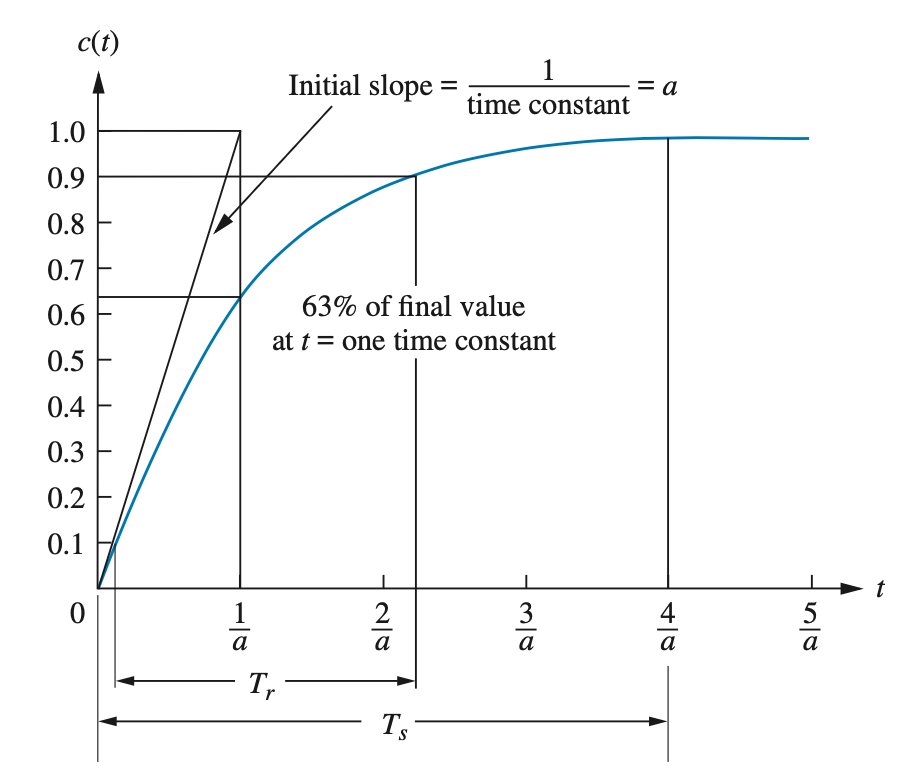
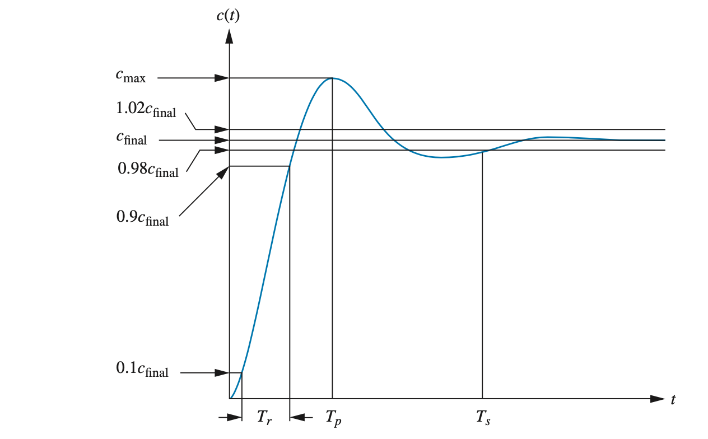
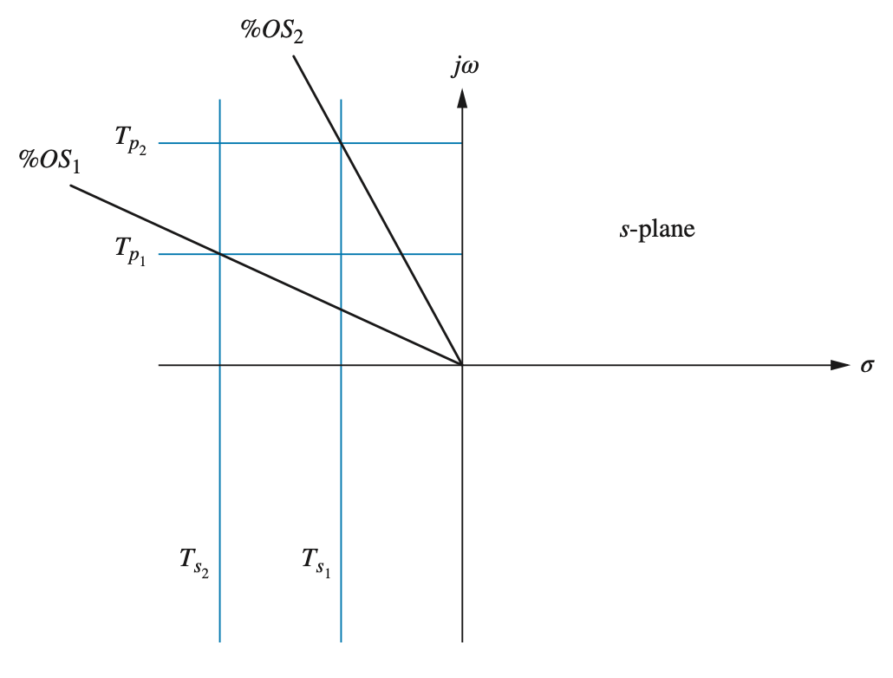

# Control Theory Equations for First- and Second-Order Systems

## 1. First-Order System

### Standard Transfer Function

$$
H(s) = \frac{K}{\tau s + 1}
$$

* $K$: steady-state gain
* $\tau$: time constant (in seconds) where the break frequency $\omega_b$ is $\omega_b=\frac{1}{\tau}$

Therefore the pole is the negative reicprocal of the time constant $\tau$, $s=-\frac{1}{\tau} $
The standard transfer function can be rewritten as:

$$
H(s) = \frac{\frac{K}{\tau}}{s+\frac{1}{\tau}} = \frac{K\ \omega_b}{s+\omega_b}
$$

Time constant $\tau$ is simply the reciprocal of the pole's location on the real axis.

Break frequency is the frequency in (rad/s) where the Bode plot behavior changes. It is the **corner frequency** (also called the **3 dB frequency**) where the magnitude response starts to drop at -20 dB/decade in the Bode plot.

**Time domain**: $\tau$ is the time it takes the step response to reach about $63.2\%$ of its final value.

**Frequency domain**: $\tau$ sets the break frequency $\omega_b=\frac{1}{\tau}$, which is the **transition point** between low-frequency flat gain and high frequency roll-off.

---

### Time Domain Responses

#### a. Impulse Response

$$
h(t) = \frac{K}{\tau} e^{-t/\tau} \cdot u(t)
$$

#### b. Step Response

$$
y(t) = K \left(1 - e^{-t/\tau}\right) \cdot u(t)
$$

---

### Performance Metrics

* **Time constant**:

$$
\tau = \frac{1}{a} \quad \text{(time to reach 63.2\% of final value)}
$$

* **Settling time (2% criterion)**:

$$
t_s \approx 4\tau \quad \text{(for 2\% criterion)}
$$

* **Rise time (90%)**:

$$
t_r \approx 2.2\tau
$$

* **Steady-state value**:

$$
y(\infty) = K
$$

---

---

## 2. Second-Order System

### Standard Transfer Function

$$
H(s) = \frac{\omega_n^2}{s^2 + 2\zeta \omega_n s + \omega_n^2}
$$

* $\omega_n$: natural frequency (rad/s)
* $2\zeta\omega_n$: damping coefficient (or damping term)
* $\zeta$: damping ratio (dimensionless)

---

### Physical Interpretations

In mechanical systems:

$$
2\zeta\omega_n = \frac{c}{m} \quad \Rightarrow \quad \zeta = \frac{c}{2m\omega_n}
$$

In electrical RLC systems:

$$
\zeta = \frac{R}{2} \sqrt{\frac{C}{L}}
$$

---

### Example:

$$
H(s) = \frac{K^2}{s^2 + 10s + K^2}
$$

Then:

$$
2\zeta\omega_n = 10, \quad \omega_n = K, \quad \zeta = \frac{10}{2K} = \frac{5}{K}
$$

---

### Pole Location

$$
\boxed{s = -\zeta\omega_n \pm j\, \omega_n\sqrt{1 - \zeta^2}}
$$

* Real part $\sigma = -\zeta \omega_n$ is the exponential decay rate
* Imaginary part $\omega_d = \omega_n \sqrt{1 - \zeta^2}$ is the damped natural frequency

These poles:

* Are complex conjugates if $0 < \zeta < 1$
* Lie at an angle $\theta = \arccos(\zeta)$
* Have magnitude $|s| = \omega_n$

---

---

### Time Domain Responses (Underdamped $0 < \zeta < 1$)

#### a. Impulse Response

$$
h(t) = \frac{\omega_n}{\sqrt{1 - \zeta^2}} e^{-\zeta \omega_n t} \sin\left(\omega_d t\right) \cdot u(t)
$$

#### b. Step Response

$$
y(t) = 1 - \frac{1}{\sqrt{1 - \zeta^2}} e^{-\zeta \omega_n t} \sin\left(\omega_d t + \phi\right) \cdot u(t)
$$

where:

$$
\phi = \arccos(\zeta)
$$

---

### Performance Metrics (Underdamped $\zeta<1$)

* **Damped natural frequency**:

$$
\boxed{\omega_d = \omega_n \sqrt{1 - \zeta^2}}
$$

* **Exponential decay rate**:

$$
\boxed{\sigma = \zeta\omega_n}
$$

* **Peak time**:

$$
\boxed{t_p = \frac{\pi}{\omega_d}}
$$

* **Percent overshoot**:

$$
\boxed{&#37 OS = 100 \cdot e^{-\frac{\pi \zeta}{\sqrt{1 - \zeta^2}}}}
$$

* **Damping ratio from %OS**:

$$
\boxed{\zeta = \frac{-\ln\left(\frac{\%OS}{100}\right)}{\sqrt{\pi^2 +\left[\ln\left(\frac{\%OS}{100}\right)\right]^2}}}
$$

* **Settling time (2% criterion)**:

$$
\boxed{t_s \approx \frac{4}{\zeta \omega_n}}
$$

* **Rise time**:

$$
\boxed{t_r \approx \frac{\pi - \phi}{\omega_d}, \quad \phi = \arccos(\zeta)}
$$

---

---

## Special Cases $(\zeta=1$, $\zeta>1)$

### Critically Damped ($\zeta = 1$)

$$
H(s) = \frac{\omega_n^2}{(s + \omega_n)^2}, \quad
y(t) = 1 - (1 + \omega_n t) e^{-\omega_n t}
$$

### Overdamped ($\zeta > 1$)

$$
H(s) = \frac{\omega_n^2}{(s - p_1)(s - p_2)}
$$

Where $p_1$, $p_2$ are real, negative, distinct.

---

## Summary Table

| Parameter          | First-Order         | Second-Order (Underdamped)                              |
| ------------------ | ------------------- | ------------------------------------------------------- |
| Time constant      | $\tau$            | $\tau = \frac{1}{\zeta \omega_n}$                    |
| Rise time          | $\approx 2.2\tau$ | $\approx \frac{\pi - \phi}{\omega_d}$                |
| Settling time      | $\approx 4\tau$   | $\approx \frac{4}{\zeta \omega_n}$                   |
| Peak time          | N/A                 | $\frac{\pi}{\omega_d}$                               |
| Overshoot          | 0                   | $100 \cdot e^{-\frac{\pi \zeta}{\sqrt{1 - \zeta^2}}}$ |
| Oscillations       | No                  | Yes if $\zeta < 1$                                    |
| Steady-state value | $K$               | 1 (normalized)                                          |

---

## Pole Location and System Behavior

| Pole Type                   | System Behavior          |
| --------------------------- | ------------------------ |
| Real, negative              | Overdamped / 1st-order   |
| Real, repeated              | Critically damped        |
| Complex conjugates (Re < 0) | Underdamped oscillations |
| Any pole with Re > 0        | Unstable system          |

---

This diagram shows:

* **Horizontal lines** = constant $\omega_d$ = constant **peak time** $T_p$
* **Vertical lines** = constant $\sigma$ = constant **settling time** $T_s$
* **Radial lines** = constant $\zeta$ = constant **percent overshoot**

---

---

### What Happens When Poles Move

**1. Vertically (constant $\sigma$)**

* Real part fixed: envelope is fixed as the frequency changes → **same decay rate, essentially the same settling time**
* Imaginary part: frequency varies → **more or less oscillation**
* Rise time: as overshoot increases → **rise time decreases**

**2. Horizontally (constant $\omega_d$)**

* Imaginary part fixed: constant frequency → **envelope changes**
* Real part: decay rate and settling time varies → **more or less damping**
* Peak time: as the imaginary part stays fixed → **peak time is constant**

**3. Radially (constant $\zeta$)**

* Shape of response preserved
* All timing shrinks or stretches
* Natural frequency varies → **faster or slower response**

---

---
