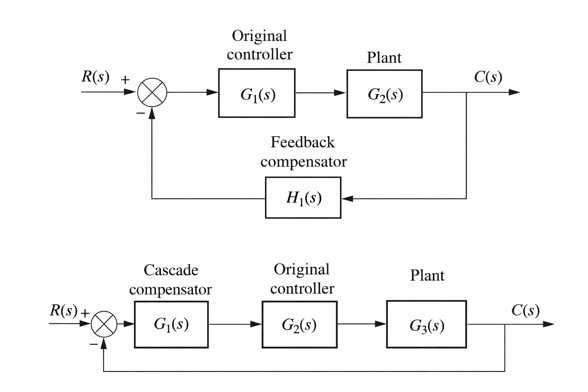
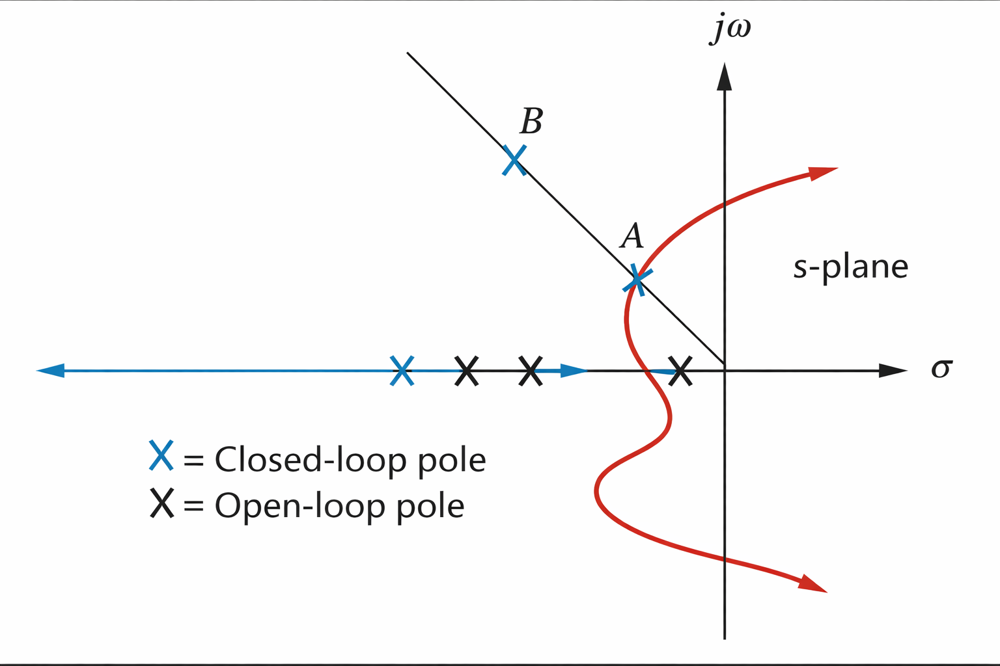

# Root Locus Design - Cascade Compensation

Systems that apply the error signal directly to the plant implement **proportional control**.

Systems that apply the time integral of the error implement **integral control**.

Systems that apply the time derivative of the error implement **derivative control**.

These control actions are not introduced as separate controllers here, but as elements that may be incorporated into a compensating network.

Two compensation configurations are considered in this document: **cascade compensation** and **feedback compensation**.

In cascade compensation, the compensating network $G_1(s)$ is inserted in series with the plant at the low-power end of the forward path. In feedback compensation, the compensating network $H_1(s)$ is placed in the feedback path.

In both cases, the compensator alters the open-loop pole–zero configuration of the system. This modification produces a new root locus whose geometry differs from that of the uncompensated plant and can be shaped to pass through a desired closed-loop pole location.

  

## Improving Transient Response
The root locus provides a mechanism for selecting loop gain to satisfy transient-response requirements. As the gain is varied, the closed-loop poles move along the root locus, and each pole location corresponds to a particular transient behavior. Selecting a specific gain therefore produces the response associated with the poles at that location.

This approach restricts the achievable transient responses to those that lie directly on the root locus.

Additional flexibility becomes available if the desired transient response corresponds to pole locations that do not lie on the existing root locus.

  

Conceptually, this situation can be represented by two candidate pole locations. Point A lies on the current root locus and represents the fastest response achievable through gain adjustment alone for a given percent overshoot. Point B represents a faster desired response with the same percent overshoot but improved settling time. Because point B does not lie on the root locus, it cannot be reached by gain variation alone.

The design objective is therefore to increase the response speed associated with point A to that of point B without altering percent overshoot.

Modifying the physical plant to obtain a different root locus is generally impractical. Physical systems are selected based on constraints such as power, torque, efficiency, size, or cost, not solely on transient response. Modifying major plant components in pursuit of improved dynamics is typically expensive and counterproductive.

Instead, the existing system is augmented through compensation. Additional poles and zeros are introduced so that the compensated system exhibits a modified root locus that passes through the desired pole location. These compensating elements are placed at the low-power end of the forward path, where they do not interfere with actuator power requirements or impose additional loading constraints. Such compensation can be implemented using passive or active networks.

One approach to improving transient response is the introduction of derivative action in the forward path. For a step input in a position-control system, the error experiences a rapid initial change. Differentiation of this change produces a large initial control signal that momentarily dominates the control input. This increased early drive accelerates system motion and reduces settling time. As the error approaches its steady-state value, its rate of change diminishes, and the contribution of the derivative term becomes negligible relative to the proportional action.

## Ideal Derivative Compensation (PD Compensator)

The transient response of a system is determined by the location of the dominant closed-loop poles in the s-plane. When the desired pole location lies on the root locus, the transient response can be achieved through adjustment of the loop gain alone.

If the desired closed-loop pole does not lie on the root locus, gain variation is insufficient. In this case, the open-loop pole–zero configuration must be modified so that the compensated root locus passes through the selected design point.

A common method for accelerating system response is the introduction of a single zero in the forward path. This is accomplished by adding a factor to the compensator numerator,

$$
\boxed{s + z_c}
$$

where the compensator zero at $-z_c$ is selected such that the desired closed-loop pole location satisfies the root-locus angle condition.

This form of compensation requires active circuitry and may introduce sensitivity to noise and actuator saturation. Nevertheless, appropriate placement of the compensator zero can significantly improve transient response relative to the uncompensated system.

By augmenting the system with an ideal derivative compensator, transient responses that cannot be achieved through gain adjustment alone become attainable.

When the compensated dominant closed-loop poles have more negative real parts than those of the uncompensated system, the resulting settling time $T_s$ and peak time $T_p$ are reduced.

In some cases, steady-state error may also improve, even though lag compensation is not explicitly employed. However, such improvement is not guaranteed and should not be assumed as a general consequence of derivative compensation.

---

### Design for PD Compensation

The compensator zero is selected using the root-locus angle condition evaluated at the desired closed-loop pole location.

The angular contributions from all existing open-loop poles and zeros to the design point are computed. The difference between the required angle of $180^\circ$ and the computed sum determines the angular contribution that must be supplied by the compensator zero.

Trigonometric relationships are then used to determine the location of the zero that provides the required angle contribution.

---

### PD Controller Design

Once the compensating zero has been selected, the ideal derivative compensator is implemented using a proportional–derivative (PD) controller.

The PD controller transfer function is

$$
\boxed{G_c(s) = K_2 s + K_1= K_2\left(s + \frac{K_1}{K_2}\right)}
$$

The ratio $\frac{K_1}{K_2}$ is chosen to equal the negative of the compensator zero location, while $K_2$ is selected to satisfy the required loop gain.

Although ideal derivative compensation improves transient response, it has practical drawbacks. Differentiation requires active circuitry and amplifies high-frequency components of the signal. Even when noise amplitude is small, its high-frequency content can produce large derivative outputs, potentially leading to saturation or undesirable actuator behavior.

To mitigate these issues, lead compensators are commonly used in practice. Lead compensation provides phase advance similar to derivative action while avoiding the disadvantages of ideal differentiation.

---

### Lead Compensation

When passive networks are used, it is not possible to realize a compensator containing a single zero alone. Instead, the network introduces both a zero and a pole. If the compensator pole is located farther from the imaginary axis than the compensator zero, the net angular contribution remains positive and approximates the effect of a single zero.

In this configuration, the angular contribution of the compensator pole subtracts from that of the zero. As long as the zero dominates, the overall effect remains equivalent to derivative action. This does not prevent the compensator from improving transient response, since the resulting net angle contribution is positive, similar to that of an ideal PD controller.

The compensator is introduced into the forward path through the factor

$$
\boxed{\frac{s + z_c}{s + p_c}}
$$

where:

* $|p_c| \gg |z_c|$, placing the pole farther from the imaginary axis than the zero
* the zero at $-z_c$ and pole at $-p_c$ are selected so that the desired design point satisfies the root-locus condition
* the pole at $-p_c$ is more negative than the zero at $-z_c$
* passive components may be used for implementation

If a desired dominant second-order pole is selected on the s-plane, the angular contributions from the uncompensated system poles and zeros to that design point can be computed. The difference between $180^\circ$ and the resulting angle sum defines the angular contribution that must be supplied by the compensator.

For example, at the selected design point,

$$
\theta_2 - \theta_1 - \theta_3 - \theta_4 + \theta_5= (2k + 1)180^\circ
$$

where the quantity $\theta_2 - \theta_1 = \theta_c$ represents the angular contribution provided by the lead compensator.

---

#### Design for Lead Compensation

An infinite number of lead compensators may satisfy a given transient-response requirement. Each choice corresponds to a different combination of compensator pole and zero locations.

Although multiple solutions exist, they differ in several practical respects, including:

* resulting static error constants
* gain required to reach the design point on the compensated root locus
* validity of the second-order dominant-pole approximation
* overall transient-response characteristics

During design, either the compensator pole or zero is selected arbitrarily. The angular contribution of this selected element is evaluated at the design point along with those of the existing system poles and zeros. The difference between the resulting angle sum and $180^\circ$ determines the required contribution of the remaining compensator element.

---

## Improving Steady-State Error

When system gain is adjusted to satisfy transient-response requirements, steady-state error performance is affected. Both transient behavior and static error constants depend on loop gain.

Increasing gain reduces steady-state error but generally increases percent overshoot. Conversely, reducing gain to limit overshoot leads to increased steady-state error. This coupling creates a tradeoff that cannot be resolved through gain adjustment alone.

Steady-state error can be improved by introducing an additional open-loop pole at the origin in the forward path. This increases the system type and forces the corresponding steady-state error to zero. Implementation of this pole requires an integrator.

In summary:

* differentiation in the forward path primarily improves transient response
* integration in the forward path primarily improves steady-state accuracy

---

### Ideal Integral Compensation

Ideal integral compensation introduces a pure integrator in the forward path, placing an open-loop pole at the origin. This increases the system type and reduces steady-state error.

For example, a Type 0 system responding to a step input exhibits a finite steady-state error. Increasing the system type by one eliminates this error. In practice, active circuitry is required to realize poles at the origin.

---

#### Design for PI Compensation

Consider a system operating with a satisfactory transient response, represented by dominant closed-loop poles at point A.

If a pole is added at the origin to increase system type, the angular contribution of the open-loop poles and zeros at point A is no longer equal to $180^\circ$. As a result, the root locus no longer passes through the original design point, and the desired transient response is disturbed.

To restore the original dominant pole location, a compensator zero is placed near the pole at the origin. When properly positioned, the angular contribution of the compensator zero approximately cancels that of the compensator pole.

With this arrangement:

* the dominant closed-loop poles remain near their original locations
* the transient response is largely preserved
* the system type is increased

Because the compensator pole and zero are placed close together, the ratio of their distances to the dominant pole is approximately unity. Consequently, the gain required to reach the design point remains nearly unchanged.

This compensation is introduced into the forward path using

$$
\boxed{\frac{s + z_c}{s}}
$$

where:

* the pole at the origin increases system type and drives steady-state error to zero
* the zero at $-z_c$ is small, negative, and placed very close to the origin
* active circuitry is required for implementation

In effect, an integrator is added to improve steady-state accuracy, while a nearby zero is introduced to prevent degradation of the transient response.

---

#### PI Controller Design

The transfer function of an ideal proportional–integral controller is

$$
\boxed{G_c(s)= K_1 + \frac{K_2}{s}= \frac{K_1\left(s + \frac{K_2}{K_1}\right)}{s}}
$$

The zero location is adjusted through the ratio $\frac{K_2}{K_1}$. In this configuration, both the error and the integral of the error are applied to the plant $G(s)$.

---

### Lag Compensation

Ideal integral compensation requires a pole at the origin, which must be implemented using an active integrator. When passive networks are used, the pole and zero are shifted slightly to the left of the origin rather than being placed exactly at it.

Although this configuration does not increase system type, it does improve the static error constant relative to the uncompensated system.

Consider an uncompensated system with velocity error constant

$$
K_v = \lim_{s \to 0} s G(s)H(s)
$$

For this system, the static error constant may be written as

$$
K_{vO} = \frac{K z_1 z_2 \cdots}{p_1 p_2 \cdots}
$$

When a lag compensator is added in the forward path, the new static error constant becomes

$$
K_{vN} = \frac{(K z_1 z_2 \cdots)(z_c)}{(p_1 p_2 \cdots)(p_c)}
$$

If the compensator pole and zero are placed close together, their angular contributions at the dominant closed-loop pole are approximately equal and opposite. As a result, the net angular contribution of the compensator is near zero, and the dominant closed-loop pole remains at approximately the same location on the compensated root locus.

Because the pole–zero pair is closely spaced, the required loop gain is also approximately unchanged. The vector lengths associated with the compensator pole and zero are nearly equal, and the remaining vectors are unaffected.

The improvement in steady-state error can therefore be evaluated directly. Substituting $K_{vO}$ into the compensated expression yields

$$
K_{vN}= K_{vO}\left(\frac{z_c}{p_c}\right)
$$

This result shows that the improvement in the static error constant is proportional to the ratio of the compensator zero magnitude to the compensator pole magnitude.

---

#### Design for Lag Compensation

To preserve transient response, the compensator pole and zero must be placed close to one another so that their angular contributions cancel.

At the same time, significant improvement in steady-state error requires the ratio $\frac{z_c}{p_c}$ to be large. These two requirements can be satisfied simultaneously by placing both the pole and zero close to the origin.

For example, a pole at -0.001 and a zero at -0.01 yields a ratio of 10, while maintaining close spacing between the two locations. In this case, the angular contribution of the compensator remains small, and transient response is minimally affected.

This compensator is introduced into the forward path using

$$
\boxed{\frac{s + z_c}{s + p_c}}
$$

where:

* ( |z_c| > |p_c| )
* the pole at $-p_c$ is small and negative
* the zero at $-z_c$ is placed slightly to the left of the pole
* steady-state error is reduced but not driven to zero
* passive components may be used for implementation

In summary, while ideal integral compensation eliminates steady-state error entirely, lag compensation improves the static error constant by a factor of $\frac{z_c}{p_c}$. When the compensator pole–zero pair is placed close to the origin, this improvement is achieved with minimal impact on transient response.

---

## Improving Both Steady-State Error and Transient Response

The compensation techniques discussed previously may be combined to improve transient response and steady-state error independently.

A common approach is to first shape the transient response using derivative-based methods, such as PD or lead compensation. Once acceptable transient behavior has been achieved, steady-state error performance is improved by applying integral-based methods, such as PI or lag compensation. A drawback of this sequence is a slight reduction in response speed when steady-state accuracy is increased.

An alternative approach is to improve steady-state error first and then modify the system to improve transient response. In some cases, the subsequent transient-response design partially degrades the previously achieved steady-state improvement. In other cases, transient-response compensation further improves steady-state behavior, potentially resulting in overdesign.

Overdesign is generally acceptable unless it introduces excessive cost, complexity, or implementation constraints. In this document, transient response is addressed first, followed by steady-state error improvement.

Both active and passive compensators may be used. When active derivative and integral compensation are combined, the resulting controller is a proportional–integral–derivative (PID) controller. When passive lead and lag compensators are combined, the resulting network is referred to as a lag–lead compensator.

---

### PID Controller Design

The transfer function of a PID controller is

$$
G_c(s)=K_1+\frac{K_2}{s}+K_3s=\frac{K_1s+K_2+K_3s^2}{s}=\frac{K_3\left(s^2+\frac{K_1}{K_3}s+\frac{K_2}{K_3}\right)}{s}
$$

This controller contains two zeros and a pole at the origin. One zero together with the pole at the origin provides integral action, while the remaining zero provides derivative action.

PID controller design proceeds by first shaping transient response through derivative action and then improving steady-state accuracy through integral action. Controller gains are selected to satisfy both requirements while maintaining overall system stability.

Verification through simulation is required after each design step to ensure that the combined effects of proportional, integral, and derivative action meet the specified performance objectives.

---

### Lag-Lead Compensator Design

Lag–lead compensation achieves improvement in both transient response and steady-state error using passive networks rather than ideal integrators and differentiators.

The design process begins with lead compensation to shape transient response. After the transient behavior has been established, the remaining steady-state error is evaluated. Lag compensation is then introduced to improve static accuracy while minimizing disturbance to the transient response.

As with PID design, simulation is used to verify that both performance objectives are satisfied. Iteration may be required if interaction between the lag and lead networks produces unintended effects.

---

## Notch Filter

Plants that contain lightly damped high-frequency modes-commonly encountered in mechanical systems-can exhibit undesirable vibration behavior. These modes are typically represented in the plant transfer function as complex-conjugate pole pairs located near the imaginary axis at high frequencies.

Under closed-loop operation, such poles may migrate closer to the imaginary axis or cross into the right half-plane. When this occurs, high-frequency oscillations or outright instability can be introduced into an otherwise acceptable low-frequency response.

These oscillations often appear as high-frequency components superimposed on the desired system behavior.

One method for suppressing these dynamics is the introduction of a notch filter in cascade with the plant. The notch filter is designed with zeros placed near the lightly damped high-frequency plant poles, along with additional real poles that ensure proper realizability and stability.

With this configuration, the root locus branch associated with the high-frequency plant poles is redirected toward the notch filter zeros. As a result, the influence of the high-frequency modes on the closed-loop dynamics is substantially reduced.

The effective pole–zero cancellation significantly attenuates the high-frequency response, allowing subsequent compensator design to focus on achieving desired low-frequency transient and steady-state performance without interference from vibration modes.

Once the high-frequency dynamics are suppressed, additional cascade compensators may be applied as needed to shape overall system behavior.

---

# Summary

Cascade compensation provides a structured method for modifying system dynamics through the addition of poles and zeros in the forward path.

Such compensators may be used to:

* improve transient response
* reduce steady-state error
* suppress undesirable dynamics, such as high-frequency vibration modes

By shaping the open-loop pole–zero configuration, cascade compensation enables the closed-loop response to be tailored while preserving the physical plant and its primary design constraints.

---
| Objective          | Compensator | Form                                                                                      | Notes                                                                                                                 |
| ------------------ | ----------- | ----------------------------------------------------------------------------------------- | --------------------------------------------------------------------------------------------------------------------- |
| Steady-state error | PI          | $K\dfrac{s+z_c}{s}$                                                                     | • Increases system type • Error driven to zero • Zero near origin • Active implementation                    |
| Steady-state error | Lag         | $K\dfrac{s+z_c}{s+p_c}$                                                                 | • Improves error (not zero) • Pole near origin • Zero slightly left of pole • Passive network                |
| Transient response | PD          | $K(s+z_c)$                                                                              | • Zero selected by root locus • Improves speed and damping • Noise / saturation risk • Active implementation |
| Transient response | Lead        | $K\dfrac{s+z_c}{s+p_c}$                                                                 | • Phase lead via pole–zero pair • Pole farther left than zero • Root-locus shaping • Passive network         |
| Both               | PID         | $K\dfrac{(s+z_{\text{lag}})(s+z_{\text{lead}})}{s}$                                     | • Integral → steady-state • Derivative → transient • Lag zero near origin • Active implementation            |
| Both               | Lag–Lead    | $K\dfrac{(s+z_{\text{lag}})(s+z_{\text{lead}})}{(s+p_{\text{lag}})(s+p_{\text{lead}})}$ | • Lag improves error • Lead improves transient • Passive implementation                                         |
---
