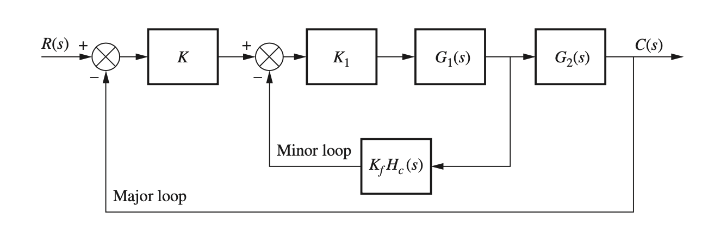
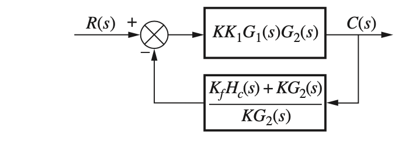
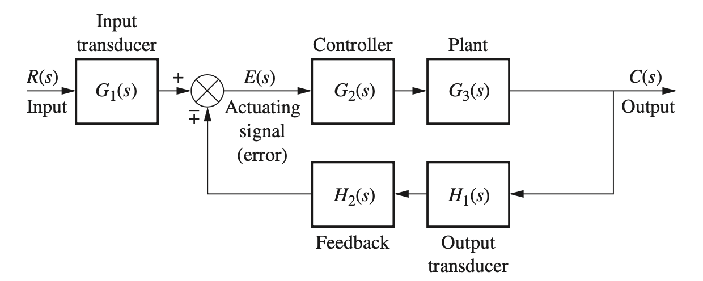

# Root Locus Design - Feedback Compensation

This is a generic control system with feedback compensation.

  

We first reduce the block diagram of this system by pushing $K$ to the right past the summing junction. We then move $G_2(s)$ to the left of the pickoff point.

The general definition of forward path is $G(s)$, while the loop gain (or open-loop transfer function) is $G(s)H(s)$.

For this generic control system with unity feedback the forward path is

$$
G_{orig}(s)= KK_1G_1(s)G_2(s)
$$

The open-loop gain (major loop only, we will add the minor loop later) is $G(s)H(s)$

$$
G_{orig}(s)H_{orig}(s)= KK_1G_1(s)G_2(s)H(s)
$$

but since we have unity feedback where $(H(s)=1)$, the open-loop transfer function is

$$
G_{orig}(s)H_{orig}(s)=KK_1G_1(s)G_2(s)
$$

In this case of unity feedback, the forward path and the open loop gain refer to the same polynomial, $G(s)$.

We now add the minor loop rate-sensor feedback branch

$$
K_fH_c(s)
$$

When we reduce the original system by moving $K$ past the first summing junction and relocating $G_2(s)$ to the left of the pickoff point, we restructure the diagram so that both feedback signals originate from the same pickoff point and enter the same summing junction. To maintain equivalence, we must divide the original minor-loop feedback path by $KG_2(s)$. Since the major loop uses unity feedback, it contributes an additive term of $+1$. The resulting composite feedback transfer function is:

$$
H_{comp}(s)=\frac{K_fH_c(s)}{KG_2}+1=\frac{K_fH_c(s)+KG_2(s)}{KG_2(s)}
$$

This reflects the fact that both feedback paths now draw from a common point in the forward path and are algebraically combined at a single summing junction.

The reduced feedback control system's block diagram is shown below.

  

The new open-loop gain expression is

$$
C(s)H_{comp}(s)
$$

But, since

$$
C(s)=G_{orig}(s)H_{orig}(s)=KK_1G_1(s)G_2(s)
$$

The new open-loop gain $C(s)H_{comp}(s)$ is

$$
C(s)H_{comp}(s)=KK_1G_1(s)G_2(s)\,\times\,\frac{K_fH_c(s)+KG_2(s)}{KG_2(s)}
$$

This gives us the loop-gain expression

$$
C(s)H_{comp}(s)=K_1G_1(s)\,[K_fH_c(s)+KG_2(s)]
$$

Group terms

$$
C(s)H_{comp}(s)=K_1G_1(s)[K_fH_c(s)+KG_2(s)]
$$

Notice that the factor $KG_2(s)$ appearing in the forward path cancels with the same factor introduced in the denominator of the composite feedback branch during block-diagram reduction.

As a result, all poles and zeros associated with (G_2(s)) vanish from the equivalent loop gain.

- All poles/zeros of $G_2(s)$ have vanished.
- The bracket $\left[K_fH_c(s)\,+\,KG_2(s)\right]$ carries a new pole-zero set (for a rate sensor on position, a real zero at $s=-K/K_f$).

If you only look at $C(s)H_{comp}(s)$, it looks exactly as though you had inserted a series compensator in $G(s)$; the root locus is reshaped in the same mathematical way.

So:

- In **cascade compensation** you deliberately wire a PD / lead / lag network in series with the plant.

- In **feedback compensation** you close an inner loop (often with a rate sensor), reduce it, and the resulting algebra acts as if you had added a new pole–zero pair in series-even though physically you changed the feedback path.

Since we are using a rate sensor, $H_c(s)=s$, and we can set $G_2(s)=1$ if the sensor is mounted right at the actuated element, and any downstream dynamics are negligible or already included in $G_1(s)$, then modelling $G_2(s)=1$ is reasonable.

The loop gain simplfies to

$$
C(s)H_{comp}(s)=K_1G_1(s)[K_fs+K]
$$

We want to isolate the $s$ term to cleary see the zero, so we pull $K_f$ in front of the square brackets

$$
C(s)H_{comp}(s)=K_1G_1(s)K_f\left[s+\frac{K}{K_f}\right]
$$

Rearranging terms we get

$$
\boxed{C(s)H_{comp}(s)=K_fK_1G_1(s)\left(s+\frac{K}{K_f}\right)}
$$

___ 
## Root Locus Workflow

For classical root-locus design the only thing you plot-and the only data you need for the construction rules-is the open-loop transfer function, or loop gain.

$$
G(s)H(s)\quad\text{where}\,C(s)=G(s)
$$

Everything on a root-locus chart comes from the poles and zeros of $G(s)H(s)$:
- open-loop poles $\rightarrow$ start points of the branches

- open-loop zeros $\rightarrow$ end points (including the implicit zeros at infinity)

- real-axis rules, asymptote angles, break­-away points, angle condition, etc.

The closed-loop poles are then the roots of

$$
1+KG(s)H(s)=0
$$

so as you vary the design gain $K$ (or any chosen parameter) they move along the branches defined purely by $G(s)H(s)$.

---
### Why the Closed-Loop Numerator is Not Needed for Root Locus

The numerator of the closed-loop transfer function

$$
T(s)=\frac{G(s)}{1+G(s)H(s)}
$$

affects zeros, steady-state gain, and exact time-response shape, but it never enters the characteristic equation $1+G(s)H(s)=0$.\
Root-locus analysis is concerned solely with the roots of that denominator, i.e. the poles of $T(s)$.

So your workflow is:

1. Reduce the block diagram until you have the equivalent $G(s)H(s)$ (after cancellations or added feedback dynamics, as we just did).

2. Plot the root locus of $G(s)H(s)$; use it to pick $K$ (or a pole/zero location) so the dominant closed-loop poles meet transient specs.

3. Afterwards, form the full closed-loop transfer function $T(s)$ to check fine-grain behaviour (exact overshoot, steady-state error, zeros, etc.).

**Reminder**

If you change the structure (e.g. add a rate-feedback minor loop), you must recompute the equivalent loop gain first, because the pole–zero set of $G(s)H)s)$ has changed. But once you have that new $G(s)H(s)$, the root-locus rules depend on nothing else.

---

### How Did We get a Zero for Free?

The presence of a rate sensor in a feedback-compensation architecture hands you the differentiator-and therefore the useful zero-“for free.”

The rate sensor is the root cause of the added zero.

### How the Zero Appears, Step-by-Step

1. Rate-sensor property

Because the feedback device is a rate gyro/tachometer, its transfer function is

$$
H_c(s)=s
$$

(it produces a signal proportional to the derivative of position).

2. Minor-loop algebra
Inside the square brackets of

$$
K_fH_c(s)+KG_2(s)
$$

you therefore get

$$
K_fs+K
$$

where the $s$ came only from the rate sensor.

3. Factor the bracket
Pulling $K_f$ out gives

$$
K_f\left(s+\frac{K}{K_f}\right),
$$

so the entire open-loop transfer function contains the factor

$$
\left(s+\frac{K}{K_f}\right),
$$

i.e. a real zero at $s=-\frac{K}{K_f}$.

### Why that matters

- If you had used a plain position sensor $H_c(s)=1$ instead of a rate sensor, the bracket would have been $(K_f+K)$ - just a constant - no zero appears.

- Thus the appearance of the zero is inseparable from the rate sensor’s $s$-term.
The designer never “places” this zero explicitly; it emerges because differentiation sits in the feedback path and interacts algebraically with the constant-gain branch.

The zero ultimately exists because the rate sensor contributes the factor $s$ in the minor feedback loop.

---

### What Happened to the Poles and Zeros of $K_1G_1(s)$?

All the poles and zeros that belong to $K_1G_1(s)$ stay exactly where they were.

#### Why they are untouched
1. Where $K_1G_1(s)$ sits\
    In the original forward path it multiplies everything before the minor-loop branch point.\
    After you form the new loop gain that same factor is still out in front:

$$
G_{new}(s)H_{new}(s)=K_1G_1(s)[K_fH_c(s)+KG_2(s)]
$$

2. No cancellation term\
    Nothing in the feedback algebra produces a matching $K_1G_1(s)$ in a denominator, so no poles or zeros of $K_1G_1(s)$ are cancelled.

---
### Net Effect on the Open-loop Dynamics

| Source of poles / zeros                     | Still present?     | Notes                                                                  |
| ------------------------------------------- | ------------------ | ---------------------------------------------------------------------- |
| $K_1G_1(s)$                                 | Yes            | Shape the root locus exactly as before.                                |
| $G_2(s)$                                    | No (cancelled) | Replaced by the bracket term.                                          |
| New bracket $\bigl[K_fH_c(s)+KG_2(s)\bigr]$ | Yes            | Introduces the “free” zero (and any poles/zeros contributed by $H_c$). |
---

So after the minor-loop reduction you are designing with a loop-gain model that contains

$$
(\text{poles/zeros of}\,\,K_1G_1)\,+\,(\text{poles/zeros of the new bracket term})

$$
**These combined sets control the reshaped root locus**.

___

### How Did the Closed-Loop Transfer Function Change?

---

First, let us derive the closed-loop transfer function for the generic feedback form topology.

  

The equivalent reduced model is shown in the figure below.

  

Turning our attention to the reduced model

$$
E(s)=R(s)\mp C(s)H(s)
$$

But since

$$
C(s)=E(s)G(s)
$$

then

$$
E(s)=\frac{C(s)}{G(s)}
$$

and by substitution

$$
\frac{C(s)}{G(s)}=R(s)\mp C(s)H(s)
$$

The definition of a transfer function is

$$
\boxed{T(s)=\frac{\text{output}}{\text{input}}=\frac{C(s)}{R(s)}}
$$

  

---

## Derivation of Closed-Loop Feedback Form

Solving the equation $\frac{C(s)}{G(s)}=R(s)\mp C(s)H(s)$, for $\frac{C(s)}{R(s)}$, we obtain the closed-loop transfer function.

We start with

$$
\frac{C(s)}{G(s)}=R(s)\mp C(s)H(s)
$$

Collect terms in $C(s)$. Bring the $C(s)-term on the right to the left:

$$
\frac{C(s)}{G(s)}\,\pm\,C(s)H(s)=R(s)
$$ 

Factor out $C(s)$:

$$
C(s)\left[\frac{1}{G(s)}\pm H(s)\right]=R(s)
$$

Form the $\frac{C(s)}{R(s)}$ by dividing both side by $R(s)$

$$
\frac{C(s)}{R(s)}\left[\frac{1}{G(s)}\pm H(s)\right]=1
$$

Simplify the expression in the square brackets:

$$
\frac{C(s)}{R(s)}\left[\frac{1\pm G(s)H(s)}{G(s)}\right]=1
$$

Multiply both side of the equation by the reciprocal of the fraction in the square brackets:

$$
\frac{C(s)}{R(s)}=\frac{G(s)}{1\pm G(s)H(s)}
$$
___

### A Note on Terminology

- $G(s)$ is the forward-path transfer function.
- When the outer feedback is unity, that forward path is numerically equal to the loop gain, so many authors of Control Systems texts casually call it "the loop gain" or "open-loop gain" even though, strictly speaking, the open loop gain is $G(s)H(s)$.

___

Returning to the derivation, the closed-loop transfer function for the feedback form is:

$$
\boxed{T(s)=\frac{G(s)}{1\pm G(s)H(s)}}
$$

The $\pm$ in the denominator is reduced to positive $+$ for negative feedback, and for positive feedback it becomes negative $-$.

---

#### Closed-Loop Transfer Function for the Original System with Only Unity Feedback

Using the equation above $T(s)=\frac{G(s)}{1\mp G(s)H(s)}$ for a closed-loop transfer function, let us derive the closed-loop unity feedback form for the original system (first figure in this document without the minor loop).

With no minor (rate-feedback) loop closed, the system reduces to a single unity-feedback system whose forward (open-loop) transfer function is

$$
G_{fwd}(s)=KK_1G_1(s)G_2(s)
$$

Because the outer loop’s feedback path is unity $H(s)=1$, the standard unity-feedback formula gives the closed-loop transfer function for the original system with no minor loop and only unity feedback:

$$
T(s)=\frac{C(s)}{R(s)}=\frac{G(s)}{1\mp G(s)H(s)}=\frac{KK_1G_1(s)G_2(s)}{1+KK_1G_1(s)G_2(s)}
$$

---

#### Closed-Loop Transfer Function for the New System with Unity Feedback and Rate Sensor Feedback (minor loop)

The equivalent reduced block diagram of the system with rate sensor feedback in the minor loop and unity feedback in the major loop is shown again below.

  

1. The closed-loop transfer function for a feedback topology is the familiar

$$
T(s)=\frac{C(s)}{R(s)}=\frac{G_{fwd}(s)}{1+G_{fwd}(s)H_{feedback}(s)}
$$

2. The forward path transfer function (from $R$ to $C$) is:

$$
G_{fwd}(s)=KK_1G_1(s)G_2(s)
$$

3. Composite feedback path (from $C(s)$ back to the summing junction):

$$
H_{equiv}(s)=\frac{K_fH_c(s)\,+\,KG_2(s)}{KG_2(s)}
$$

4. Write the closed-loop transfer function $T(s)$

$$
\frac{C(s)}{R(s)}=\frac{KK_1G_1(s)G_2(s)}{1\,+\,\left[KK_1G_1(s)G_2(s)\right]\,\times\,\frac{K_fH_c(s)\,+\,KG_2(s)}{KG_2(s)}}
$$

Simplifying

$$
\boxed{\frac{C(s)}{R(s)}=\frac{KK_1G_1(s)G_2(s)}{1\,+\,K_1G_1(s)(K_fH_c(s)\,+\,KG_2(s))}}
$$

This is precisely 'forward path divided by $1\,+\,$(forward $\times$ composite feedback).'

5. Special case: rate sensor minor-loop\
If $H_c(s)=s$ (pure rate feedback) and you take $G_2(s)=1$, this collapses to

$$
\boxed{T(s)=\frac{KK_1G_1(s)G_2(s)}{1\,+\,K_1G_1(s)(K_fs\,+\,K))}}
$$
---
## Derivation of Nested Feedback Loop Reduction (Inside-Out Method)

  

We analyze the control system structure shown in the figure above, which contains a minor feedback loop (i.e., rate sensor compensation) nested inside a major unity-feedback loop. The goal is to reduce the system algebraically, starting from the inner loop and working outward, and derive the closed-loop transfer function.

---

### Signal Definitions (from figure above):

- $ R(s) $: Input
- $ E(s) $: Output of the first summing junction (error signal)
- $ X(s) $: Output of block $ K $
- $ U(s) $: Output of block $ K_1 $
- $ Y(s) $: Output of block $ G_1(s) $
- $ C(s) $: Final output (output of $ G_2(s) $)

### Block Order:

$$
R(s)
\rightarrow \boxed{-}
\rightarrow \boxed{K}
\rightarrow \boxed{K_1}
\rightarrow \boxed{G_1(s)}
\rightarrow \boxed{G_2(s)}
\rightarrow C(s)
$$

### Feedback Paths:

- **Minor loop**: $ K_f H_c(s) $, from $ Y(s) $ to subtractor before $ K_1 $
- **Major loop**: Unity feedback from $ C(s) $ to the front

---

### Step 1: Reduce the Inner (Minor) Feedback Loop

We treat the minor loop as an isolated single-loop feedback system with:

- **Forward path**: $ K_1 G_1(s) $
- **Feedback path**: $ K_f H_c(s) $
- **Input**: $ X(s) $ (output of gain block $ K $)
- **Output**: $ Y(s) $

Using the standard negative feedback formula:

$$
Y(s) = \frac{K_1 G_1(s)}{1 + K_1 G_1(s) K_f H_c(s)} \cdot X(s)
$$

> We multiply by $ X(s) $ because this is the input to the inner loop. The feedback term $ K_f H_c(s) \cdot Y(s) $ is already accounted for in the denominator via the feedback formula.

---

### Step 2: Reconnect the Inner Loop to the Outer System

Recall that:

- $ X(s) = K [R(s) - C(s)] $
- $ C(s) = G_2(s) Y(s) $

Substitute for $ Y(s) $:

$$
C(s) = G_2(s) \cdot \frac{K_1 G_1(s)}{1 + K_1 G_1(s) K_f H_c(s)} \cdot K [R(s) - C(s)]
$$

---

### Step 3: Expand and Group $ C(s) $ Terms

Distribute:

$$
C(s) = \frac{K K_1 G_1(s) G_2(s)}{1 + K_1 G_1(s) K_f H_c(s)} \cdot [R(s) - C(s)]
$$

Multiply both sides by the denominator:

$$
C(s) \cdot \left[1 + K_1 G_1(s) K_f H_c(s)\right] = K K_1 G_1(s) G_2(s) \cdot [R(s) - C(s)]
$$

Distribute the right-hand side:

$$
C(s) \cdot \left[1 + K_1 G_1(s) K_f H_c(s)\right] + K K_1 G_1(s) G_2(s) \cdot C(s)
= K K_1 G_1(s) G_2(s) \cdot R(s)
$$

Group all $ C(s) $ terms on the left:

$$
C(s) \cdot \left[1 + K_1 G_1(s) K_f H_c(s) + K K_1 G_1(s) G_2(s)\right]
= K K_1 G_1(s) G_2(s) \cdot R(s)
$$

---

### Step 4: Solve for the Closed-Loop Transfer Function

Now divide both sides by the bracketed term:

$$
\frac{C(s)}{R(s)} =
\frac{K K_1 G_1(s) G_2(s)}
{1 + K_1 G_1(s) K_f H_c(s) + K K_1 G_1(s) G_2(s)}
$$

---

### Step 5: Express in Open-Loop Form

Group the denominator:

$$
\frac{C(s)}{R(s)} =
\frac{K K_1 G_1(s) G_2(s)}
{1 + K_1 G_1(s) [K_f H_c(s) + K G_2(s)]}
$$

---

## Final Result

### Closed-Loop Transfer Function:

$$
T(s) = \frac{C(s)}{R(s)} =
\frac{K K_1 G_1(s) G_2(s)}
{1 + K_1 G_1(s) \left[K_f H_c(s) + K G_2(s)\right]}
$$

### Open-Loop Transfer Function (for root locus):

$$
G(s)H(s) = K_1 G_1(s) \left[K_f H_c(s) + K G_2(s)\right]
$$

---

### Notes:

- Grouping the $ C(s) $ terms means moving all terms involving $ C(s) $ to one side of the equation, factoring them, and solving for $ \frac{C(s)}{R(s)} $. This gives the characteristic equation in the denominator.
- This “inside-out” approach (reduce inner loop first) is preferred in professional control design. It reveals how inner-loop compensation (i.e., rate feedback) shapes the effective plant for the outer loop.

---
