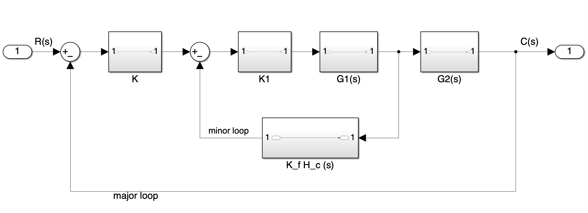
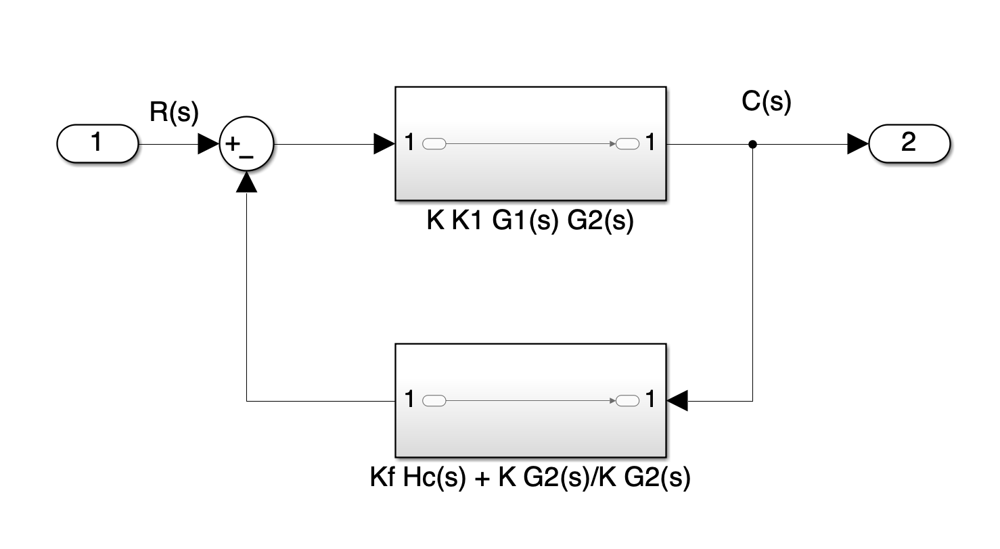
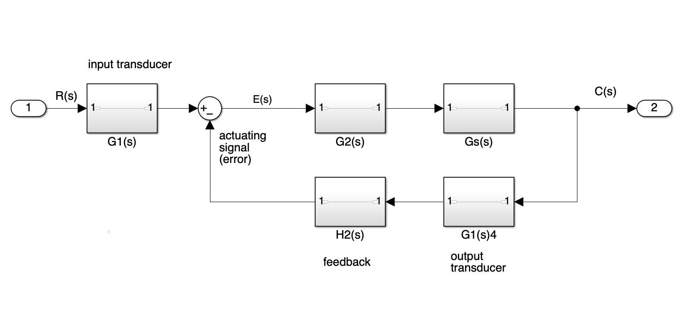
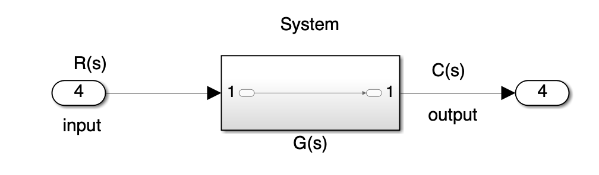

# Root Locus Design - Feedback Compensation

*Author: Percival Segui*\
*Prepared as an independent technical reference.*

*Engineering notes compiled and derived from standard classical control theory.*

---

## Feedback Compensation - Loop-Gain Formation

This section develops the loop gain for a feedback-compensated system by explicit block-diagram reduction and algebraic simplification.

---

  

---

The system under consideration is shown in the figure above.

---

### Forward path and loop-gain definitions

For a feedback system:

* the **forward path** is denoted $G(s)$
* the **loop gain** open-loop transfer function is $G(s)H(s)$

These are distinct definitions in general.

---

### Forward path of the original system

From the diagram, the forward signal path is

$$
K\quad\rightarrow\quad K_1\quad\rightarrow\quad G_1(s)\quad\rightarrow\quad G_2(s)
$$

Therefore,

$$
G_{\text{orig}}(s) = K\ K_1\ G_1(s)\ G_2(s)
$$

---

### Open-loop gain of the major loop

The open-loop gain is defined as

$$
G_{\text{orig}}(s)H_{\text{orig}}(s)
$$

Substituting the forward path:

$$
G_{\text{orig}}(s)H_{\text{orig}}(s)=K K_1 G_1(s) G_2(s)\ H(s)
$$

The major loop uses unity feedback, so

$$
H(s)=1
$$

Therefore,

$$
G_{\text{orig}}(s)H_{\text{orig}}(s)=K K_1 G_1(s) G_2(s)
$$

In a unity-feedback system, the forward path and the open-loop gain are numerically identical, even though they are conceptually distinct.

---

## Introduction of the minor feedback loop

A rate-sensor feedback branch is now added:

$$
K_f H_c(s)
$$

This branch feeds back from an internal plant variable rather than from the final output.

---

### Structural rearrangement

To combine the major and minor feedback paths algebraically, two standard block-diagram operations are performed:

1. Move gain $K$ to the right of the first summing junction
2. Move block $G_2(s)$ to the left of the pickoff point

After these operations:

* both feedback signals originate from the same pickoff point
* both feedback signals enter the same summing junction

This restructuring allows the feedback paths to be combined algebraically.

---

### Scaling required to preserve equivalence

Because $K$ and $G_2(s)$ were moved across summing and pickoff points, the minor feedback signal must be scaled to preserve equivalence.

The original minor-loop signal was:

$$
K_f H_c(s)
$$

After relocation, the feedback signal must be divided by the elements that were moved past it:

$$
K G_2(s)
$$

Therefore, the scaled minor-loop feedback becomes

$$
\frac{K_f H_c(s)}{K G_2(s)}
$$

---

### Composite feedback transfer function

The major loop contributes unity feedback, which is equivalent to an additive term of $+1$.

Thus, the composite feedback transfer function is

$$
H_{\text{comp}}(s)= 1 + \frac{K_f H_c(s)}{K G_2(s)}
$$

Write over a common denominator:

$$
H_{\text{comp}}(s)=\frac{K_f H_c(s) + K G_2(s)}{K G_2(s)}
$$

  

This expression represents both feedback paths acting at the same summing junction.

---

## Formation of the new loop gain

The loop gain of the reduced system is

$$
C(s)\ H_{\text{comp}}(s)
$$

From earlier,

$$
L(s) = G_{\text{orig}}(s)H_{\text{orig}}(s)
= K K_1 G_1(s) G_2(s)
$$

Substitute:

$$
C(s)H_{\text{comp}}(s)K K_1 G_1(s) G_2(s)
\left(\frac{K_f H_c(s) + K G_2(s)}{K G_2(s)}\right)
$$

---

### Explicit cancellation

Write numerator and denominator clearly:

$$
C(s)H_{\text{comp}}(s)\frac{\cancel{K}\ K_1 G_1(s)\ \cancel{G_2(s)}\ [K_f H_c(s) + K G_2(s)]}{\cancel{K}\ \cancel{G_2(s)}}
$$

After cancellation:

$$
C(s)H_{\text{comp}}(s)K_1 G_1(s)\ [K_f H_c(s) + K G_2(s)]
$$

---

### Interpretation of the cancellation

* all poles and zeros of $G_2(s)$ are removed from the loop gain
* the dynamics of $G_2(s)$ no longer influence the root locus
* a new pole–zero structure appears inside the bracketed term

> *“This cancellation is exact in the mathematical model; physical robustness must be evaluated separately.”*

The bracket

$$
[K_f H_c(s) + K G_2(s)]
$$

is entirely responsible for the compensating behavior introduced by the minor loop

---

## Relation to cascade compensation

If only the reduced loop gain is examined,

$$
C(s)H_{\text{comp}}(s)K_1 G_1(s)\ [K_f H_c(s) + K G_2(s)]
$$

the result appears mathematically identical to inserting a compensator in series with the plant.

Thus:

* **cascade compensation** inserts dynamics physically in series
* **feedback compensation** inserts dynamics through an inner loop

After reduction, both approaches reshape the root locus in the same mathematical way.

---

## Rate-sensor specialization

For a rate sensor,

$$
H_c(s)=s
$$

If the sensor is mounted at the actuated element, and downstream dynamics are negligible or already included in $G_1(s)$, it is reasonable to model

$$
G_2(s)=1
$$

Substitute into the loop gain:

$$
C(s)H_{\text{comp}}(s)K_1 G_1(s)[K_f s + K]
$$

---

### Isolating the zero explicitly

Factor out $K_f$:

$$
K_f\left(s + \frac{K}{K_f}\right)
$$

Substitute:

$$
C(s)H_{\text{comp}}(s)K_1 G_1(s)\ K_f
\left(s + \frac{K}{K_f}\right)
$$

Rearrange constants:

$$
\boxed{C(s)H_{\text{comp}}(s)K_f K_1 G_1(s)\left(s + \frac{K}{K_f}\right)}
$$

---

### Resulting structure

The reduced loop gain contains:

* all poles and zeros of $K_1 G_1(s)$
* one additional real zero at

$$
s = -\frac{K}{K_f}
$$

This zero arises entirely from the rate-sensor feedback path and appears without explicit placement by the designer.

---

### Root Locus Workflow

For classical root-locus design, the only object used to construct the plot is the **loop gain** $open-loop transfer function$:

$$
L(s)=G(s)H(s)
$$

In the reduced form we just built, $L(s)$ is the polynomial (or rational function) whose poles/zeros drive every root-locus rule.

Everything on the root-locus chart is determined by the poles and zeros of $L(s)$:

* open-loop poles $\rightarrow$ branch start points
* open-loop zeros $\rightarrow$ branch end points (including zeros at infinity)
* real-axis segments, asymptotes, breakaway/break-in points, angle condition, etc.

Closed-loop poles are the roots of the characteristic equation

$$
1+K\ L(s)=0
$$

Equivalently,

$$
1+K\ G(s)H(s)=0
$$

As the design gain $K$ varies, those roots trace the branches defined purely by $L(s)=G(s)H(s)$.

---

### Why the Closed-Loop Numerator Is Not Needed for Root Locus

The closed-loop transfer function is

$$
T(s)=\frac{G(s)}{1+G(s)H(s)}
$$

The numerator $G(s)$ affects the closed-loop **zeros** and the overall scaling of the response, but the closed-loop **poles** come only from the denominator.

The pole locations are the roots of

$$
1+G(s)H(s)=0
$$

Root locus is specifically a tool for tracking how those roots move as a scalar gain is varied, so the workflow stays focused on the loop-gain denominator.

---

### Root-Locus Workflow (procedural)

1. **Reduce the block diagram** until the equivalent loop gain $L(s)=G(s)H(s)$ is explicit (including any cancellations and any new factors introduced by inner-loop reduction).

2. **Plot the root locus of $L(s)$** and choose $K$ (or another design parameter) so the dominant closed-loop poles satisfy the transient requirements.

3. **Afterward**, form the full closed-loop transfer function $T(s)$ and check detailed behavior (steady-state gain, overshoot, non-dominant poles, zeros, etc...)

If the structure changes (for example, adding a rate-feedback minor loop), the loop gain changes first. Root-locus rules still depend only on the updated loop gain $L(s)$.

---

### How Did We Get a Zero “for Free”?

The added zero comes from the rate sensor. The differentiating behavior enters through the minor-loop element $H_c(s)$, and the algebra forces that (s)-term into the loop gain.

This is the full chain, step-by-step.

---

### How the Zero Appears, Step-by-Step

#### Step 1 - Rate-sensor transfer function

For a rate sensor (tachometer/gyro), the compensating element is modeled as

$$
H_c(s)=s
$$

So the minor-loop feedback block is

$$
K_f H_c(s)=K_f s
$$

---

#### Step 2 - Identify the bracket that carries the new dynamics

From the prior reduction, the reduced loop gain was

$$
L_{\text{new}}(s)=G_{\text{new}}(s)H_{\text{new}}(s)K_1G_1(s)\ [K_fH_c(s)+K G_2(s)]
$$

The “new” pole/zero structure introduced by feedback compensation is entirely inside the square bracket:

$$
[K_fH_c(s)+K G_2(s)]
$$

---

#### Step 3 - Substitute the rate-sensor model into the bracket

Substitute $H_c(s)=s$ into the bracket:

$$
K_fH_c(s)+K G_2(s)K_f s + K G_2(s)
$$

This is the first place the (s)-term appears. It enters only through the rate sensor.

---

#### Step 4 - Specialize to $G_2(s)=1$ (if applicable)

If $G_2(s)=1$, then

$$
K_f s + K G_2(s)=K_f s + K
$$

So the loop gain becomes

$$
L_{\text{new}}(s)=K_1G_1(s)\ [K_f s+K]
$$

---

#### Step 5 - Factor the bracket to expose the zero

Factor out $K_f$:

$$
K_f s + K = K_f\left(s + \frac{K}{K_f}\right)

$$

Now substitute that back into the loop gain:

$$
L_{\text{new}}(s)K_1G_1(s)\ K_f\left(s+\frac{K}{K_f}\right)
$$

So the loop gain contains the explicit factor

$$
\left(s+\frac{K}{K_f}\right)
$$

That is a real zero located at

$$
s=-\frac{K}{K_f}
$$

---

### Why that matters

If the compensating sensor were a position sensor instead of a rate sensor, then $H_c(s)=1$. Re-run the same steps:

Start from the bracket:

$$
K_fH_c(s)+K G_2(s)
$$

Substitute $H_c(s)=1$:

$$
K_f(1)+K G_2(s)=K_f+K G_2(s)
$$

If $G_2(s)=1$, then

$$
K_f+K
$$

That is a constant. A constant factor does not introduce a zero. So:

* $H_c(s)=1 $ $\rightarrow $ no (s)-term $\rightarrow$ no zero
* $H_c(s)=s $ $\rightarrow $ bracket contains an (s)-term $\rightarrow$ zero appears after factoring

The zero exists because the rate sensor contributes the factor (s) inside the minor-loop branch.

---

### What Happened to the Poles and Zeros of $K_1G_1(s)$?

They stay exactly where they were.

Here is the explicit reason.

Start from the reduced loop gain:

$$
L_{\text{new}}(s)=K_1G_1(s)\ [K_fH_c(s)+K G_2(s)]
$$

* $K_1G_1(s)$ appears only as a **multiplicative factor** in the numerator of $L_{\text{new}}(s)$.

* No part of the reduction produced a denominator term containing $K_1G_1(s)$.

* Therefore, there is no cancellation mechanism for any pole or zero of $K_1G_1(s)$.

So the pole/zero set of $K_1G_1(s)$ is preserved, and the root locus is reshaped only by:

* removing the contribution of $G_2(s)$ (via cancellation), and

* adding the bracket term $[K_fH_c(s)+K G_2(s)]$

---

### Net Effect on the Open-Loop Dynamics

| Source of poles/zeros  | Still present?    | What happens                                                                    |
| ---------------------- | ----------------- | ------------------------------------------------------------------------------- |
| $K_1G_1(s)$            | **Yes**           | Poles/zeros remain unchanged.                                                   |
| $G_2(s)$               | **No** (canceled) | Its poles/zeros vanish from the loop gain after reduction.                      |
| $[K_fH_c(s)+K G_2(s)]$ | **Yes**           | Introduces new pole/zero structure including the “free” zero from $H_c(s)=s$. |

After minor-loop reduction, root-locus design uses the combined pole/zero set in

$$
L_{\text{new}}(s)=K_1G_1(s)\ [K_fH_c(s)+K G_2(s)]
$$

Those two factors fully determine the reshaped root locus.

---

### How Did the Closed-Loop Transfer Function Change?

We now derive the closed-loop transfer function for the generic feedback topology.

  

The unreduced configuration contains separate forward-path and feedback-path elements. After standard block-diagram reduction, the system can be represented in the canonical single-loop form.

---

### Start from the reduced feedback model

From the reduced diagram, the actuating signal (error) is

  

$$
E(s)=R(s)\mp C(s)H(s)
$$

The sign depends on whether the feedback is negative or positive. For stability analysis and classical control design, negative feedback is assumed.

---

### Express the output in terms of the error

From the forward path,

$$
C(s)=E(s)G(s)
$$

Solve this expression for (E(s)):

$$
E(s)=\frac{C(s)}{G(s)}
$$

---

### Substitute into the error equation

Substitute $E(s)=\dfrac{C(s)}{G(s)}$ into the earlier expression:

$$
\frac{C(s)}{G(s)} = R(s)\mp C(s)H(s)
$$

At this point, all variables are written in terms of (C(s)) and (R(s)).

---

### Collect terms involving $C(s)$

Move all terms containing $C(s)$ to one side:

$$
\frac{C(s)}{G(s)} \pm C(s)H(s) = R(s)
$$

Factor $C(s)$:

$$
C(s)\left[\frac{1}{G(s)} \pm H(s)\right] = R(s)
$$

---

### Solve for the closed-loop transfer function

Divide both sides by $R(s)$:

$$
\frac{C(s)}{R(s)} = \frac{1}{\dfrac{1}{G(s)} \pm H(s)}
$$

Multiply numerator and denominator by $G(s)$:

$$
\frac{C(s)}{R(s)} = \frac{G(s)}{1 \pm G(s)H(s)}
$$

---

### Closed-loop transfer function

By definition, the transfer function is

$$
\boxed{T(s)=\frac{\text{output}}{\text{input}}=\frac{C(s)}{R(s)}}
$$

  

Therefore, the closed-loop transfer function of the feedback system is

$$
\boxed{T(s)=\frac{G(s)}{1 \pm G(s)H(s)}}
$$

For negative feedback, the standard form is

$$
\boxed{T(s)=\frac{G(s)}{1+G(s)H(s)}}
$$

---

### Derivation of the Closed-Loop Feedback Form

We begin from the reduced feedback relation

$$
\frac{C(s)}{G(s)} = R(s) \mp C(s)H(s)
$$

This equation expresses the actuating signal both in terms of the input and in terms of the output fed back through $H(s)$.

---

### Step 1 - Collect terms in $C(s)$

Move the feedback term on the right-hand side to the left:

$$
\frac{C(s)}{G(s)} \pm C(s)H(s) = R(s)
$$

---

### Step 2 - Factor out $C(s)$

$$
C(s)\left[\frac{1}{G(s)} \pm H(s)\right] = R(s)
$$

---

### Step 3 - Form the ratio $\dfrac{C(s)}{R(s)}$

Divide both sides by $R(s)$:

$$
\frac{C(s)}{R(s)}\left[\frac{1}{G(s)} \pm H(s)\right] = 1
$$

---

### Step 4 - Combine terms inside the bracket

Write the bracketed expression over a common denominator:

$$
\frac{1}{G(s)} \pm H(s)\frac{1 \pm G(s)H(s)}{G(s)}
$$

Substitute back:

$$
\frac{C(s)}{R(s)}\left[\frac{1 \pm G(s)H(s)}{G(s)}\right]= 1
$$

---

### Step 5 - Solve explicitly for $\dfrac{C(s)}{R(s)}$

Multiply both sides by the reciprocal of the bracketed fraction:

$$
\frac{C(s)}{R(s)} = \frac{G(s)}{1 \pm G(s)H(s)}
$$

---

### Closed-loop transfer function

By definition,

$$
T(s)=\frac{C(s)}{R(s)}
$$

Therefore, the closed-loop transfer function of the generic feedback form is

$$
\boxed{T(s)=\frac{G(s)}{1 \pm G(s)H(s)}}
$$

For negative feedback, the denominator takes the familiar form

$$
\boxed{T(s)=\frac{G(s)}{1 + G(s)H(s)}}
$$

---

### A Note on Terminology

* $G(s)$ denotes the forward-path transfer function.
* The true loop gain is $G(s)H(s)$.
* When the feedback path is unity $(H(s)=1)$, the forward path and loop gain are numerically identical.

For this reason, many control texts loosely refer to $G(s)$ as the “open-loop gain” in unity-feedback systems, even though the formal definition is $G(s)H(s)$.

---

## Closed-Loop Transfer Function - Unity Feedback Only

Consider the original system with **no minor loop closed**.

The forward-path transfer function is

$$
G_{\text{fwd}}(s)=K K_1 G_1(s) G_2(s)
$$

Because the outer feedback path is unity,

$$
H(s)=1
$$

Substituting into the closed-loop formula:

$$
T(s)=\frac{G(s)}{1+G(s)H(s)}
$$

gives

$$
\boxed{T(s)=\frac{K K_1 G_1(s) G_2(s)}{1 + K K_1 G_1(s) G_2(s)}}

$$

This is the closed-loop transfer function of the original system before the rate-feedback minor loop is introduced.

---

## Closed-Loop Transfer Function - Unity Feedback with Rate-Feedback Minor Loop

After reducing the system with the minor loop closed, the equivalent feedback form consists of:

* a forward path
* a composite feedback path

  

---

### Step 1 - Start from the general feedback formula

For any feedback topology,

$$
T(s)=\frac{C(s)}{R(s)}\frac{G_{\text{fwd}}(s)}{1 + G_{\text{fwd}}(s)H_{\text{feedback}}(s)}
$$

---

### Step 2 - Forward path of the reduced system

From the reduced diagram,

$$
G_{\text{fwd}}(s)=K K_1 G_1(s) G_2(s)
$$

---

### Step 3 - Composite feedback path

The feedback path from the output back to the summing junction is

$$
H_{\text{comp}}(s)\frac{K_fH_c(s)+K G_2(s)}{K G_2(s)}
$$

This expression represents the algebraic combination of the unity major loop and the rate-feedback minor loop after block-diagram reduction.

---

### Step 4 - Form the closed-loop transfer function

Substitute the forward and feedback expressions into the standard formula:

$$
\frac{C(s)}{R(s)}\frac{K K_1 G_1(s) G_2(s)}{1 +\left[K K_1 G_1(s) G_2(s)\right]\left(\frac{K_fH_c(s)+K G_2(s)}{K G_2(s)}\right)}
$$

---

### Step 5 - Simplify the denominator

Cancel the common factor $K G_2(s)$:

$$
\boxed{\frac{C(s)}{R(s)}\frac{K K_1 G_1(s) G_2(s)}{1 + K_1 G_1(s)\left(K_fH_c(s)+K G_2(s)\right)}}
$$

This expression is exactly:

$$
\text{forward path}\ \bigg/ \left[1 + (\text{forward})(\text{composite feedback})\right]
$$

with all algebra shown explicitly.

---

### Special Case - Rate Sensor Minor Loop

If the compensating sensor is a rate sensor,

$$
H_c(s)=s
$$

and if the dynamics between the actuator and sensor are negligible so that

$$
G_2(s)=1
$$

then the closed-loop transfer function becomes

$$
\boxed{T(s)\frac{K K_1 G_1(s)}{1 + K_1 G_1(s)(K_f s + K)}}
$$

This form makes clear:

* the minor loop does not merely scale the system,
* it reshapes the closed-loop denominator,
* and the differentiating behavior enters explicitly through the (s)-term.

---

## Derivation of Nested Feedback Loop Reduction (Inside-Out Method)

  

We analyze the control system structure shown in the figure above, which contains a **minor feedback loop** (i.e., rate sensor compensation) nested inside a **major unity-feedback loop**. The goal is to reduce the system algebraically, starting from the **inner loop** and working outward, and derive the closed-loop transfer function.

---

### Signal Definitions (from figure above):

- $R(s)$: Input
- $E(s)$: Output of the first summing junction (error signal)
- $X(s)$: Output of block $K$
- $U(s)$: Output of block $K_1$
- $Y(s)$: Output of block $G_1(s)$
- $C(s)$: Final output (output of $G_2(s)$)

### Block Order:

$$
R(s)\rightarrow \boxed{-}\rightarrow \boxed{K}\rightarrow \boxed{K_1}\rightarrow \boxed{G_1(s)}\rightarrow \boxed{G_2(s)}\rightarrow C(s)
$$

### Feedback Paths:

- **Minor loop**: $K_f H_c(s)$, from $Y(s)$ to subtractor before $K_1$
- **Major loop**: Unity feedback from $C(s)$ to the front

---

### Step 1: Reduce the Inner (Minor) Feedback Loop

We treat the minor loop as an isolated single-loop feedback system with:

- **Forward path**: $K_1 G_1(s)$
- **Feedback path**: $K_f H_c(s)$
- **Input**: $X(s)$ (output of gain block $K$)
- **Output**: $Y(s)$

Using the standard negative feedback formula:

$$
Y(s) = \frac{K_1 G_1(s)}{1 + K_1 G_1(s) K_f H_c(s)} \cdot X(s)
$$

> We multiply by $X(s)$ because this is the input to the inner loop. The feedback term $K_f H_c(s) \cdot Y(s)$ is already accounted for in the denominator via the feedback formula.

---

### Step 2: Reconnect the Inner Loop to the Outer System

Recall that:

- $X(s) = K [R(s) - C(s)]$
- $C(s) = G_2(s) Y(s)$

Substitute for $Y(s)$:

$$
C(s) = G_2(s) \cdot \frac{K_1 G_1(s)}{1 + K_1 G_1(s) K_f H_c(s)} \cdot K [R(s) - C(s)]
$$

---

### Step 3: Expand and Group $C(s)$ Terms

Distribute:

$$
C(s) = \frac{K K_1 G_1(s) G_2(s)}{1 + K_1 G_1(s) K_f H_c(s)} \cdot [R(s) - C(s)]
$$

Multiply both sides by the denominator:

$$
C(s) \cdot \left[1 + K_1 G_1(s) K_f H_c(s)\right] = K K_1 G_1(s) G_2(s) \cdot [R(s) - C(s)]
$$

Distribute the right-hand side:

$$
C(s) \cdot \left[1 + K_1 G_1(s) K_f H_c(s)\right] + K K_1 G_1(s) G_2(s) \cdot C(s)
= K K_1 G_1(s) G_2(s) \cdot R(s)
$$

Group all $C(s)$ terms on the left:

$$
C(s) \cdot \left[1 + K_1 G_1(s) K_f H_c(s) + K K_1 G_1(s) G_2(s)\right]
= K K_1 G_1(s) G_2(s) \cdot R(s)
$$

---

### Step 4: Solve for the Closed-Loop Transfer Function

Now divide both sides by the bracketed term:

$$
\frac{C(s)}{R(s)} =
\frac{K K_1 G_1(s) G_2(s)}
{1 + K_1 G_1(s) K_f H_c(s) + K K_1 G_1(s) G_2(s)}
$$

---

### Step 5: Express in Open-Loop Form

Group the denominator:

$$
\frac{C(s)}{R(s)} =
\frac{K K_1 G_1(s) G_2(s)}
{1 + K_1 G_1(s) [K_f H_c(s) + K G_2(s)]}
$$

---

## Final Result

### Closed-Loop Transfer Function:

$$
T(s) = \frac{C(s)}{R(s)} =
\frac{K K_1 G_1(s) G_2(s)}
{1 + K_1 G_1(s) \left[K_f H_c(s) + K G_2(s)\right]}
$$

### Open-Loop Transfer Function (for root locus):

$$
G(s)H(s) = K_1 G_1(s) \left[K_f H_c(s) + K G_2(s)\right]
$$

---

### Notes:

- Grouping the $C(s)$ terms means moving all terms involving $C(s)$ to one side of the equation, factoring them, and solving for $\frac{C(s)}{R(s)}$. This gives the characteristic equation in the denominator.
- This “inside-out” approach (reduce inner loop first) is preferred in professional control design. It reveals how inner-loop compensation (i.e., rate feedback) shapes the effective plant for the outer loop.

---
